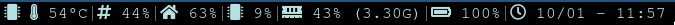
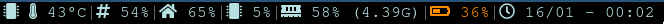

Nicely looking i3bar using [conky](https://github.com/brndnmtthws/conky) as data feed.

# Reuirements

1. Install conky. Instructions on how to install can be found on the [repo](https://github.com/brndnmtthws/conky/wiki/Installation#conky-on-operating-systems).

2. Install [Font Awesome](https://github.com/FortAwesome/Font-Awesome). [Instructions](https://fontawesome.com/how-to-use/on-the-web/setup/using-package-managers)

# Steps

1. Clone this repo  
    
        git clone git@github.com:emvoo/conky-i3bar.git $HOME/.config/i3

1. Copy scripts dir to .conky directory  

        cp -r $HOME/.config/i3/conky-i3bar/scripts $HOME/.conky 

1. Create simlink to [conkyrc](conkyrc)

        ln -s .config/i3/conky-i3bar/conkyrc .conkyrc

1. Add/replace contents of your i3 config to contain  
      
        bar {
            status_command $HOME/.config/i3/conky-i3bar/conky-i3bar
        }

1. Reload your i3 (usually $mod + R)
